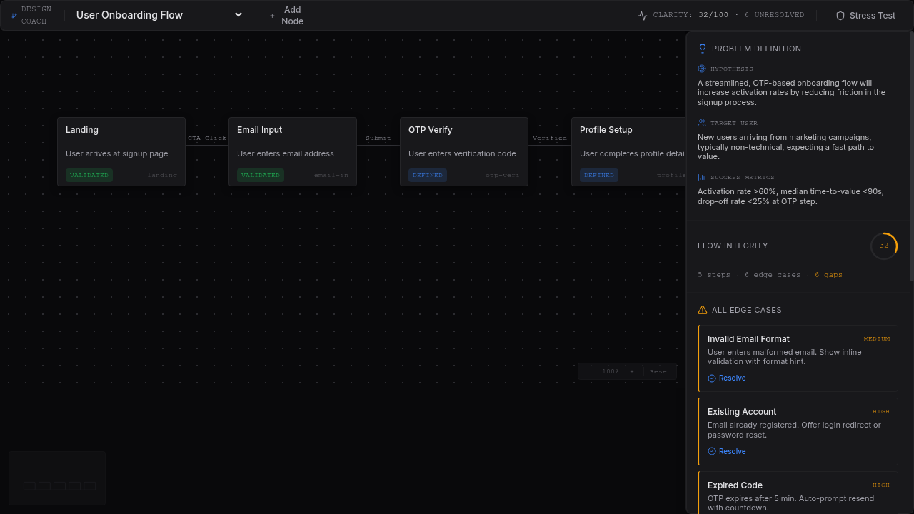

# Design Coach

> An interactive flow-mapping canvas for PMs and builders to structure product flows, surface edge cases, document tradeoffs, and measure decision clarity — before writing a line of production code.

**Status:** `published`
**Complexity:** `complex`
**Bucket:** `PM productivity`

---

## Goal

Give PMs a structured, visual environment to map product flows end-to-end, force edge-case coverage, and quantify how "thought-through" a design is via a Clarity Score — replacing ad-hoc docs and whiteboard sessions with a repeatable, inspectable artifact.

---

## Problem

Product flows are typically sketched in Figma, Miro, or Google Docs with no systematic way to track whether edge cases are covered, tradeoffs are documented, or failure modes are addressed. Gaps surface late — in code review, QA, or production — when they're expensive to fix. There's no "lint for product thinking."

---

## Why This Exists

A visual canvas alone doesn't prevent gaps. Design Coach combines a pannable/zoomable flow canvas with a structured inspector that tracks edge cases by severity, tradeoff positions on explicit spectrums, and a weighted Clarity Score that quantifies completeness. It turns "I think we covered everything" into a measurable, reviewable state.

---

## Target Persona

A PM, product designer, or technical lead at a small-to-mid team who owns a feature flow end-to-end and needs to validate completeness before handing off to engineering — especially for flows with branching logic, error states, or multi-step user journeys.

---

## Use Cases

- A PM maps a new onboarding flow, identifies 6 edge cases, resolves them one by one, and watches the Clarity Score climb from 32 to 100 before writing the spec.
- A designer drags nodes to restructure a checkout flow, verifying that connector lines and edge case associations update in real time.
- A tech lead activates Stress Test mode before a design review to surface all unhandled critical failure paths in one view.
- A team documents tradeoff positions (e.g., "Security vs. Friction" at 65%) so future contributors understand *why* the flow works the way it does.

---

## Barebones Wireframe

```
┌───────────────────────────────────────────────────────────────────────┐
│ Design Coach   [Flow Selector ▼]   [+ Add Node]    Clarity: 32/100  │
│                                                      [Stress Test]   │
├──────────────────────────────────────┬────────────────────────────────┤
│                                      │ PROBLEM DEFINITION             │
│   ┌────────┐    ┌────────┐          │   Hypothesis: ...              │
│   │Landing │───▶│Email   │───▶ ...  │   Target User: ...             │
│   │        │    │Input   │          │   Success Metrics: ...         │
│   └────────┘    └────────┘          │                                │
│                                      │ FLOW INTEGRITY          [72]  │
│   (pannable, zoomable canvas)        │   5 steps · 6 edge cases      │
│                                      │                                │
│                     [- 100% + Reset] │ EDGE CASES                     │
│                                      │   ☐ Invalid Email   MEDIUM     │
│                                      │   ☐ Expired Code    HIGH       │
│                                      │                                │
│                                      │ TRADEOFF PANEL                 │
│                                      │   Security ●────── Friction    │
│                                      │   Collection ──●── Speed       │
└──────────────────────────────────────┴────────────────────────────────┘
```

---

## Product Decisions

- **Clarity Score as a weighted composite (not a checklist):** The score blends node validation (30%), edge case resolution (50%), and tradeoff documentation (20%). Alternative was a simple "X of Y resolved" counter; rejected because it doesn't incentivize balanced coverage across all dimensions.
- **Edge cases tied to specific nodes:** Each edge case is associated with a flow node, so selecting a node filters to its relevant cases. Alternative was a flat list; rejected because it loses spatial context and makes large flows unnavigable.
- **Interactive tradeoff sliders with persistence:** Slider positions save to global state and survive flow switching. Alternative was static labels; rejected because the value is in forcing an explicit position on each spectrum.
- **Canvas pan/zoom with drag-to-reposition nodes:** The canvas supports mouse-drag panning, scroll-wheel zooming (0.25x–3x), and individual node dragging with live connector updates. Alternative was a fixed-layout auto-arrange; rejected because PMs need to express flow structure spatially.
- **Stress Test mode as a toggle overlay:** When activated, it surfaces only unresolved critical failure paths in a dedicated section. Alternative was always-visible; rejected because it clutters the default editing view.

---

## Tech Stack

- **Runtime:** Vite + React 18 with TypeScript
- **Framework:** React with Context API for state management
- **AI/API:** none — all logic is client-side
- **Styling:** Tailwind CSS with semantic design tokens, shadcn/ui components, Framer Motion animations
- **Data:** In-memory state with demo flows (no persistence layer)
- **Deployment:** Static hosting via Lovable publish, or any static host

---

## How to Run

**Prerequisites:** Node.js 20+.

```bash
# Clone
git clone [repo-url]
cd projects/2026-03-17-design-coach

# Install
npm install

# Run
npm run dev
```

**Open:** http://localhost:5173

---

## Screenshots



*Flow canvas showing the User Onboarding Flow with 5 nodes, connector lines, zoom controls, and the inspector panel displaying edge cases, tradeoffs, and a Clarity Score of 32/100.*

---

## Future Enhancements

- **Persistent storage:** Save flows to a database so work survives page reload. Deferred because the current focus is on the interaction model, not infrastructure.
- **Export to Markdown:** Generate a structured document of the entire flow analysis including edge cases, tradeoffs, and clarity score. Deferred to keep V1 scope tight.
- **Custom tradeoffs:** Let users define their own tradeoff spectrums beyond the preset ones. Deferred because presets validate the interaction pattern first.
- **Collaborative editing:** Real-time multiplayer flow editing for team reviews. Deferred because it requires backend infrastructure and conflict resolution.
- **Flow templates:** Pre-built flow templates for common patterns (auth, checkout, settings). Deferred because the demo flows serve this purpose for now.

---

## Decision Log

See [decision-log.md](./decision-log.md) for a full record of design and scoping decisions.
