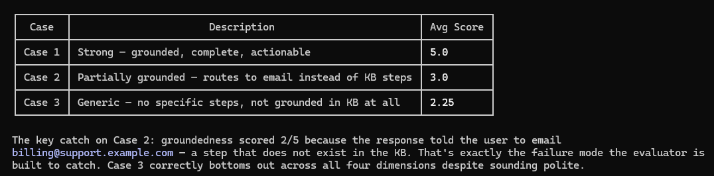

# Response Evaluator

> A lightweight evaluation workflow that scores AI-generated support responses across four quality dimensions — relevance, groundedness, completeness, and actionability.

**Week:** W04 — Month 1 (Customer Support Copilot)
**Stack:** Python, OpenAI (`gpt-4o-mini`), python-dotenv

---

## Problem

AI systems can generate fluent, confident-sounding responses that are wrong, incomplete, or not grounded in your knowledge base. Without a scoring step, there is no way to tell the difference between a good response and a plausible-looking bad one. Generation without evaluation is an incomplete pipeline.

---

## Why This Matters

A support copilot that produces responses with no quality signal cannot improve. You cannot tune prompts without a score to tune against. You cannot catch regressions without a baseline. You cannot make decisions about when to show a response to a user versus when to escalate — without a score, every response looks equally valid.

Evaluation is not optional infrastructure. It is how you define what "good" means before you scale.

---

## Why AI

Scoring a response against a rubric requires reading comprehension across three inputs simultaneously: the ticket, the retrieved KB context, and the generated response. The evaluator must check semantic alignment across all three, not just surface-level keyword matching. A small LLM handles this well, is fast, and is cheap enough to run on every response at evaluation time.

---

## Why Not a Simpler Approach

A static checklist cannot adapt to the semantic content of each response. Keyword matching misses cases where the response addresses the issue using different wording from the KB. Human review is too slow and inconsistent at any meaningful scale. A rubric-based LLM evaluator is the right fit for this task: structured enough to produce consistent scores, flexible enough to handle natural language variation.

---

## Why This Is a Workflow, Not an Agent

The evaluation steps are fixed and predefined: receive three inputs → apply rubric → return scores. There is no decision-making about what to do next, no dynamic tool selection, no branching based on intermediate results. The path through the system is the same for every evaluation. That is a workflow, not an agent.

Adding agent infrastructure here — a planning loop, a tool registry, dynamic step selection — would add complexity, latency, and debugging surface without improving the quality of the scores. The evaluator does not need to decide what to evaluate or how to evaluate it. The rubric is known ahead of time.

---

## Why Not Agents Yet

- **Evaluation criteria are predefined.** The rubric — relevance, groundedness, completeness, actionability — does not change based on ticket content. There is nothing for an agent to decide.
- **The process is linear and auditable.** Three inputs in, four scores out. Every run follows the same path. Agentic behavior would obscure that auditability without adding value.
- **No tool selection is needed.** One LLM call with a fixed prompt produces the output. A tool registry would be overhead with no benefit.
- **Agents are the right choice when the path through a task is unknown.** Here the path is completely known. Workflows beat agents when the steps are fixed — they are simpler to implement, faster to debug, and easier to explain to stakeholders.

---

## What I Built

A Python module (`evaluate_response.py`) that takes three inputs and returns a structured evaluation across four dimensions with per-dimension scores and justifications. A CLI demo runner (`run_demo.py`) that loads an example case and prints the full evaluation output in a readable format.

---

## Inputs

| Input | Description |
|---|---|
| `ticket` | Raw support ticket text as submitted by the user |
| `retrieved_context` | KB content surfaced by the W02 retrieval layer |
| `generated_response` | The response being evaluated |

---

## Outputs

```json
{
  "relevance":     { "score": 4, "justification": "Response directly addresses the login failure described in the ticket." },
  "groundedness":  { "score": 5, "justification": "All steps are drawn from the retrieved KB article on password reset." },
  "completeness":  { "score": 4, "justification": "Covers the primary fix and offers a fallback if it does not work." },
  "actionability": { "score": 5, "justification": "User has a clear, ordered set of steps to follow immediately." },
  "average": 4.5
}
```

---

## Evaluation Dimensions

| Dimension | What it measures |
|---|---|
| **Relevance** | Does the response address what the user actually asked? A response that answers a different question scores low even if it is accurate. |
| **Groundedness** | Is the response based on the retrieved KB context, not invented facts? A response that introduces information not present in the context scores low. |
| **Completeness** | Does the response cover all parts of the issue? A response that addresses only half the ticket scores low even if the addressed half is good. |
| **Actionability** | Can the user take a clear next step from this response? A response that explains the issue without telling the user what to do scores low. |

Scale: 1 (Poor) → 2 (Weak) → 3 (Acceptable) → 4 (Good) → 5 (Excellent)

---

## Failure Modes

- **Over-scoring confident prose:** The model tends to give 4s to responses that sound fluent and confident, even when they lack specific steps. Watch for high relevance + low actionability as a pattern.
- **Groundedness is the hardest dimension:** Detecting invented facts requires the evaluator to compare the response claims against the retrieved context word by word. The model sometimes misses subtle hallucinations.
- **Justifications describe the score instead of explaining it:** Short justifications can become tautological ("This response is relevant because it addresses the ticket"). Monitor for this and improve via prompt iteration.
- **Context length sensitivity:** Very long KB context may cause the evaluator to attend to only part of it. Keep retrieved context focused — consistent with W02's top-K retrieval design.

---

## What I Learned

- The evaluator reliably catches the weakest case: a generic, non-grounded response that looks plausible but is not tied to the KB. This is the highest-value catch.
- Groundedness scoring is the most sensitive to prompt wording. The prompt needs to explicitly instruct the model to compare the response against the retrieved context, not just assess whether the response "seems accurate."
- Keeping scores and justifications as separate fields (rather than a combined narrative) produces more consistent output and is easier to use downstream.

---

## What This Unlocks for Month 1

Month 1 built a four-layer pipeline:

| Week | Layer | What it does |
|---|---|---|
| W01 | Input Normalization | Structures messy product inputs into clean JSON |
| W02 | KB Retrieval | Surfaces relevant KB articles for a given ticket |
| W03 | Ticket Triage | Classifies tickets into urgency, category, and KB topic |
| W04 | Response Evaluation | Scores generated responses against a quality rubric |

W04 closes the quality loop. Without evaluation, the pipeline generates responses with no way to measure or improve them. With evaluation, every response produces a score — and that score becomes the feedback signal for tuning prompts, catching regressions, and making routing decisions.

---

## What This Demonstrates

- **Lightweight evaluation loops for AI systems** — evaluation does not require a production-grade eval platform to be useful. A structured rubric and one LLM call is sufficient to produce a meaningful quality signal.
- **Defining quality beyond "looks good"** — four explicit dimensions replace subjective gut-check review with a reproducible scoring process.
- **Structured scoring for support responses** — scores are machine-readable, comparable across runs, and usable as a tuning signal.
- **Judgment about when a workflow is better than an agent** — the scoring path is known ahead of time. Workflows win when the steps are fixed; agents are the right tool when the path is not known in advance.

---

## How to Run

**Prerequisites:** Python 3.11+, an OpenAI API key

```bash
cd weekly-builds/2026-w04-response-evaluator

# Install dependencies
pip install openai python-dotenv

# Configure
cp .env.example .env
# Edit .env: OPENAI_API_KEY=sk-...

# Run the demo (evaluates the first example case)
python code/run_demo.py

# Evaluate a specific case (0, 1, or 2)
python code/run_demo.py 1

# Run the module directly for a smoke test
python code/evaluate_response.py
```

---

## Screenshots



*Three evaluation cases scored: strong response (5.0), partially grounded (3.0), and generic/weak (2.25) — demonstrating the evaluator discriminates across quality levels.*
